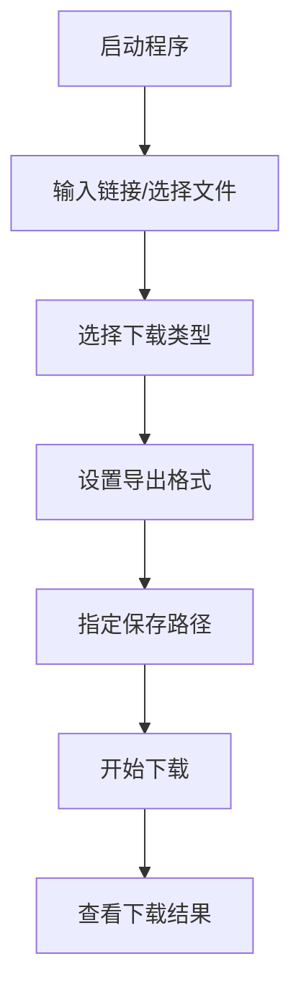
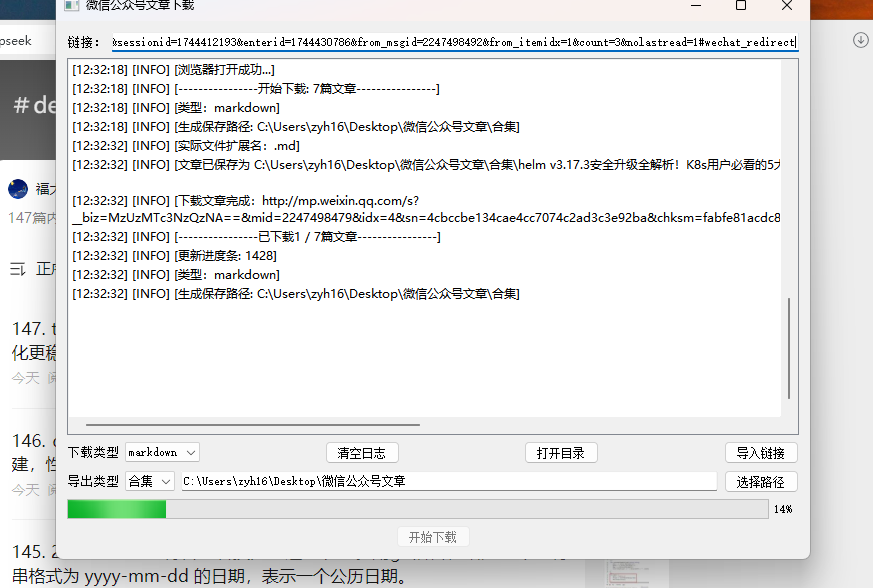
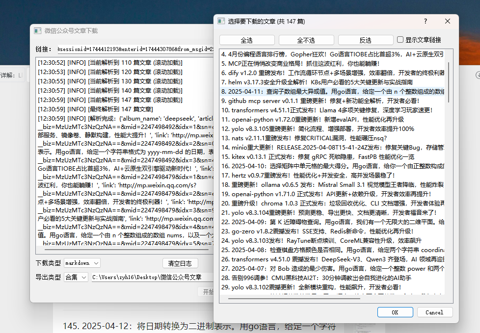

[英文](https://github.com/yowaimono/WeClip/blob/main/docs/README_en.md) | [中文](https://github.com/yowaimono/WeClip/blob/main/README.md)

# 微信公众号文章下载工具 📚

## 简介 ✨

WeClip 是一款专业、高效的桌面应用程序，专为微信公众号内容收藏者设计。只需简单操作，即可将喜爱的文章或合集永久保存到本地，支持多种格式导出，打造您的私人知识库。

## 功能概览 ✅

### 📥 下载功能

- [x] 单篇文章下载
- [x] 合集一键下载
- [x] 批量链接处理（TXT 导入）

### 📂 导出格式

- [x] Markdown (.md)
- [x] HTML (.html)
- [ ] PDF (.pdf) _(开发中)_

### 🛠 附加功能

- [x] 自定义保存路径
- [x] 实时下载日志
- [x] 智能合集解析
- [x] 合集文章数量预估
- [x] 一键打开输出目录

## 快速开始 🚀

1. 运行 `main_ui.py`
2. 粘贴文章/合集链接 或 选择包含链接的 TXT 文件
3. 配置下载选项
4. 点击"开始下载"按钮
5. 通过日志查看进度

## 开发状态 🛠

### 已实现功能 ✔️

- Markdown/HTML 导出
- 合集下载
- 批量下载
- html/markdown 导出

### 开发中功能 🔧

- PDF 导出支持
- 下载失败重试机制

### 计划功能 📅

- 定时自动下载
- 浏览器插件扩展

## 如何贡献 🤝

欢迎通过以下方式参与：

- 报告 Bug 🐛 → [新建 Issue]
- 提交代码 💻 → [发起 PR]
- 改进文档 📖 → [编辑 README]

## 许可证 ⚖️

MIT License © 2025 yowaimono

## 联系我们 📩

- 📧 Email: zhangyanhai278@gamil.com
- 💬 Issues: [点击](https://github.com/yowaimono/WeClip/issues)
- 🌍 主页: [点击](https://github.com/yowaimono/WeClip)

---

> ℹ️ 使用提示：请合理使用工具，遵守微信公众号内容使用规范
