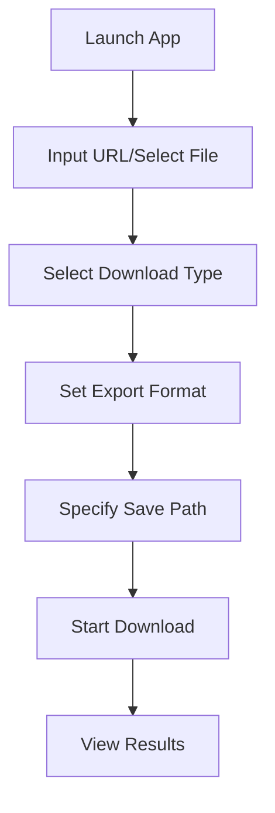

[English](https://github.com/yowaimono/WeClip/blob/main/docs/README_en.md) | [Chinese](https://github.com/yowaimono/WeClip/blob/main/README.md)

# WeChat Official Account Article Downloader 📚

## Introduction ✨

WeClip is a powerful desktop application designed for archiving WeChat Official Account articles and collections. Easily save your favorite content locally in various formats to build your personal knowledge base.

## Feature Status ✅

### 📥 Download Capabilities

- [x] Single article download
- [x] Complete collection download
- [x] Batch processing via TXT file

### 📂 Export Formats

- [x] Markdown (.md)
- [x] HTML (.html)
- [ ] PDF (.pdf) _(In development)_

### 🛠 Additional Features

- [x] Custom save path
- [x] Real-time download logging
- [x] Intelligent collection parsing
- [x] Article count estimation for collections
- [x] One-click open output directory

## Quick Start 🚀

1. Run `main_ui.py`
2. Paste article/collection URL or select TXT file with multiple URLs
3. Configure download options
4. Click "Start Download"
5. Monitor progress via logs

## Development Status 🛠

### Implemented Features ✔️

- Markdown/HTML export
- Collection processing

### In Development 🔧

- PDF export support
- Download retry mechanism

### Planned Features 📅

- Scheduled downloads
- Browser extension

## How to Contribute 🤝

We welcome contributions through:

- Bug reports 🐛 → [Open Issue]
- Code submissions 💻 → [Submit PR]
- Documentation improvements 📖 → [Edit README]

## License ⚖️

MIT License © 2025 yowaimono

## Contact 📩

- 📧 Email: zhangyanhai278@gamil.com
- 💬 Issues: [Click](https://github.com/yowaimono/WeClip/issues)
- 🌍 Homepage: [Click](https://github.com/yowaimono/WeClip)

---

> ℹ️ Usage Note: Please use this tool responsibly in compliance with WeChat Official Account content policies.
